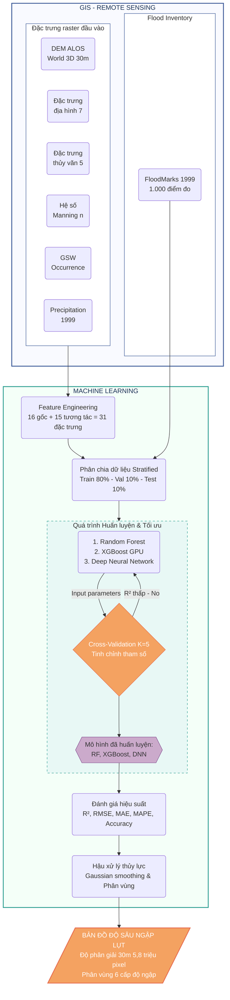

<div align="center">

<!-- Animated Header -->


<h3>
  
</h3>

<br>

[](https://github.com/ntuson0810-droid/Hue-Depth-Flood-Mapping)
[](https://github.com/ntuson0810-droid/Hue-Depth-Flood-Mapping)
[](https://www.python.org/)

<br>

**[📌 Giới Thiệu](#-giới-thiệu)** |
**[🔄 Quy Trình](#-quy-trình-nghiên-cứu)** |
**[🗂 Dữ Liệu](#-bộ-dữ-liệu-chi-tiết)** |
**[🤖 Mô Hình](#-các-mô-hình)** |
**[📊 Kết Quả](#-kết-quả-thực-nghiệm)** |
**[🚀 Cài Đặt](#-cài-đặt--sử-dụng)**

</div>

<br>

---

<div align="center">

## 📌 Giới Thiệu

</div>

**Hue Depth Flood Mapping** là dự án nghiên cứu ứng dụng công nghệ **Viễn thám (Remote Sensing)**, **Hệ thống thông tin địa lý (GIS)** và các thuật toán **Học máy (Machine Learning)** để mô phỏng, dự báo định lượng và thành lập bản đồ độ sâu ngập lụt tại khu vực tỉnh Thừa Thiên Huế. Lấy sự kiện đại hồng thủy lịch sử tháng 11/1999 làm kịch bản tham chiếu chính, dự án chuyển đổi từ bài toán phân loại ngập/không ngập truyền thống sang bài toán **hồi quy định lượng** để ước lượng trực tiếp độ sâu ngập lụt (m) tại từng điểm ảnh phân giải 30m.

### 🎯 Ý Nghĩa & Điểm Đột Phá

> Ngập lụt là một trong những thách thức nghiêm trọng nhất tại Duyên hải miền Trung. Việc xác định định lượng độ sâu ngập (m) thay vì chỉ xác định ranh giới ngập mang lại giá trị to lớn cho công tác sơ tán và quy hoạch.

**Điểm đột phá của dự án là áp dụng khung tiếp cận Physics-Informed Machine Learning (Học máy tích hợp tri thức vật lý):**
```diff
+ 1. Tích hợp hệ số nhám Manning's N từ dữ liệu lớp phủ bề mặt ESA WorldCover (theo bảng Chow 1959).
+ 2. Áp dụng 11 ràng buộc đơn điệu (monotonic constraints) trong XGBoost để đảm bảo tính nhất quán vật lý.
+ 3. Xây dựng 15 đặc trưng tương tác thủy lực (ví dụ: sức cản, độ dẫn nước).
+ 4. Hậu xử lý thủy lực (hydraulic post-processing) theo 4 vùng địa hình đặc thù (cap-only & bathtub spreading).
```

<br>

---

<div align="center">

## 🔄 Quy Trình Nghiên Cứu

</div>

<div align="center">


*Sơ đồ 1: Luồng quy trình nghiên cứu từ thu thập dữ liệu viễn thám đến thành lập bản đồ*

</div>

<br>

---

<div align="center">

## 🗂 Bộ Dữ Liệu Chi Tiết

</div>

Dự án sử dụng 31 đặc trưng đầu vào, được khai thác và xử lý từ 5 nguồn dữ liệu viễn thám và thực địa uy tín:

| Dữ liệu gốc | Nguồn cung cấp | Độ phân giải | Các đặc trưng trích xuất / dẫn xuất |
|---|---|---|---|
| **ALOS World 3D** | JAXA | 30m | DSM gốc, Độ dốc (Slope), Hướng sườn (Aspect), Độ cong (Curvature), Độ gồ ghề (Roughness), TPI, Chỉ số ẩm TWI. |
| **MERIT-Hydro** | Yamazaki (2019) | 30m | **HAND** (Height Above Nearest Drainage), Tích lũy dòng chảy (Flow Acc), Sức mạnh dòng chảy (SPI). |
| **ESA WorldCover 2021** | ESA | 10m $\rightarrow$ 30m | Lớp phủ bề mặt (LULC), chuyển đổi thành **Hệ số nhám Manning's N** qua bảng tra cứu thủy lực. |
| **JRC Global Surface Water**| JRC / Ủy ban Châu Âu| 30m | Xác suất xuất hiện bề mặt nước lịch sử (`gsw_occure`). |
| **Lượng mưa trạm** | Đài KTTV Trung Trung Bộ| 5 trạm | Tổng lượng mưa tích lũy 11/1999 (nội suy không gian bằng IDW). |
| **FloodMarks 1999** | Khảo sát thực địa | Điểm | **Biến mục tiêu**: Độ sâu ngập lụt tại 1.000 vị trí (Zero-inflated). |

<br>

---

<div align="center">

## 🤖 Các Mô Hình

</div>

Ba thuật toán đại diện cho các trường phái Machine Learning hiện đại được tinh chỉnh:

1. **Random Forest (RF - v5)**: Thuật toán baseline Ensemble mạnh mẽ, đạt kết quả tốt nhất về độ chính xác tổng thể ($R^2 = 0.8946$) nhờ khả năng chống nhiễu trên dữ liệu zero-inflated.
2. **XGBoost (Extreme Gradient Boosting - GPU v5)**: Tích hợp 11 ràng buộc đơn điệu (monotonic constraints) để mô hình học đúng các quy luật bảo toàn vật lý (như HAND tăng thì ngập giảm). Huấn luyện siêu tốc trên GPU CUDA.
3. **Deep Neural Network (DNN - v6)**: Kiến trúc mạng Nơ-ron 4 lớp ẩn với L2 Regularization & Dropout. Sử dụng hàm kích hoạt Sigmoid ở lớp đầu ra tạo giới hạn **Bounded Output [0, 5m]**, tối ưu cực tốt việc phân biệt ranh giới vùng an toàn và ngập lụt.

*Nghiên cứu cũng độc lập kiểm chứng phát hiện của Grinsztajn et al. (NeurIPS 2022) rằng các mô hình tree-based (RF, XGBoost) vẫn duy trì lợi thế so với mạng nơ-ron sâu trên dữ liệu dạng bảng có kích thước vừa và nhỏ.*

<br>

---

<div align="center">

## 📊 Kết Quả Thực Nghiệm

</div>

Kết quả dự báo được hậu xử lý bằng bộ lọc Gaussian và đánh giá thông qua tập kiểm thử (Test 10%). Điểm đáng chú ý: **Độ cao địa hình (DEM)** và các biến tương tác liên quan chiếm gần **80% tầm quan trọng** (Feature Importance).

### 1. Mô hình Random Forest ($R^2 = 0.8946$)
Bản đồ dự báo mượt mà và phân hóa rất tốt ở các vùng ngập từ 0.5m đến 2m. 

<div align="center">
  
  
</div>

### 2. Mô hình XGBoost - Physics-Informed ($R^2 = 0.8884$)
Dự báo mang tính "quyết liệt" hơn do áp dụng chặt chẽ các quy luật bảo toàn vật lý. Vạch rõ ranh giới các vùng ngập cực sâu (>2m) dọc các lưu vực sông chính.

<div align="center">
  
  
</div>

### 3. Mô hình Deep Neural Network ($R^2 = 0.8847$)
Xử lý xuất sắc các điểm Không Ngập nhờ cấu trúc Sigmoid giới hạn độ sâu đầu ra (RMSE cho các điểm 0m cực kỳ thấp: 0.070m).

<div align="center">
  
  
</div>

<br>

---

<div align="center">

## 🚀 Cài Đặt & Sử Dụng

</div>

### 📁 Cấu Trúc Thư Mục

```text
Hue-Depth-Flood-Mapping/
├── data/
│   ├── raw/           # Dữ liệu bảng (CSV, Excel mốc ngập)
│   ├── spatial/       # Dữ liệu không gian vector
│   └── raster/        # Chứa dữ liệu DEM, LULC, Mưa (Bỏ qua trên Github do kích thước >100MB)
├── src/
│   ├── core/          # MODULE TÁI CẤU TRÚC (Chứa toàn bộ logic không gian, thủy văn dùng chung)
│   ├── dnnmanningv5.py / dnnnomannings.py
│   ├── rfmanningsv5.py / rfnomannings.py
│   └── xgbmanningsv5.py / xgbnomannings.py
└── results/           # Kết quả đầu ra (bản đồ .tif, đồ thị đánh giá, weights)
```

### ⚙️ Yêu Cầu & Cài Đặt

Mã nguồn đã được mô-đun hóa (Clean Code). Khuyến nghị sử dụng **Miniconda** hoặc **Anaconda** để quản lý môi trường.

```bash
git clone https://github.com/ntuson0810-droid/Hue-Depth-Flood-Mapping.git
cd Hue-Depth-Flood-Mapping

# Tạo môi trường ảo
conda create -n flood python=3.9
conda activate flood

# Cài đặt thư viện
pip install pandas numpy rasterio geopandas scikit-learn xgboost tensorflow matplotlib tqdm
```

### 💻 Sử Dụng

Do giới hạn dung lượng trên Github, các file Raster gốc kích thước lớn (`.tif`) không được tải lên. Cần đặt các file Raster thực tế vào thư mục `data/raster/` trước khi chạy.

Mở Terminal tại thư mục gốc và chạy các script để huấn luyện và sinh bản đồ:

```bash
python src/rfmanningsv5.py
python src/xgbmanningsv5.py
python src/dnnmanningv5.py
```
