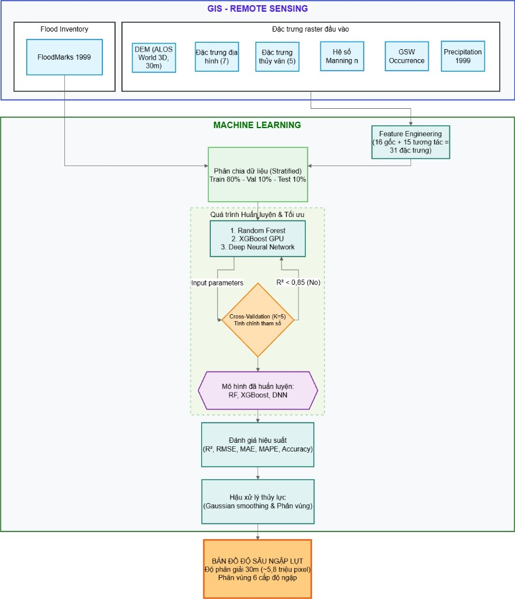

# Hue Depth Flood Mapping: A Physics-Informed Machine Learning Approach

[](https://www.python.org/)
[](https://ee-ntuson2003nts.projects.earthengine.app/view/machine-learning--remote-sensing-hue-flood-depth-mapping)
[](https://opensource.org/licenses/MIT)

This repository contains the implementation of a physics-informed machine learning pipeline to predict and map continuous flood depths and flood risk zones in Thừa Thiên Huế province, Vietnam. 

**[🔗 Access the Google Earth Engine Interactive Demo](https://ee-ntuson2003nts.projects.earthengine.app/view/machine-learning--remote-sensing-hue-flood-depth-mapping)**

---

## Table of Contents
1. [Overview](#overview)
2. [Methodology & Workflow](#methodology--workflow)
3. [Dataset and Features](#dataset-and-features)
4. [Models & Results](#models--results)
5. [Installation & Usage](#installation--usage)
6. [Data Sources](#data-sources)
7. [Citation & Contact](#citation--contact)

---

## Overview

Predicting flood depth accurately is critical for disaster management. This project applies modern Machine Learning architectures (Random Forest, XGBoost, and Deep Neural Networks) combined with hydraulic domain knowledge (Physics-Informed approach) to estimate flood depths based on historical data from the devastating November 1999 flood in Huế.

**Key Contributions:**
- **High-Resolution Mapping:** Generates 30m resolution continuous flood depth maps (~5.8 million pixels).
- **Physics-Informed Engineering:** Integrates Manning's roughness coefficient (N), HAND (Height Above Nearest Drainage), and monotonic constraints within tree-based algorithms.
- **Zero-Inflated Handling:** Effectively models the zero-depth (non-flooded) boundaries to prevent false-positive inundation in higher elevations.
- **Automated Spatial Pipeline:** Modularized Python codebase capable of extracting pixel-level values from large GeoTIFFs, building interaction features, training models, and rendering predicted spatial layers.

---

## Methodology & Workflow

The workflow integrates Geographic Information Systems (GIS) for spatial data processing and Machine Learning for predictive modeling.



*Workflow: From GIS data collection to feature engineering, model training, and spatial post-processing.*

---

## Dataset and Features

The dataset comprises 31 spatial features (16 base variables + 15 interaction terms) extracted from multiple remote sensing and hydrological sources:

| Source Data | Provider / Citation | Resolution | Extracted / Derived Features |
|---|---|---|---|
| **ALOS World 3D** | JAXA | 30m | DSM, Slope, Aspect, Curvature, Roughness, TPI, TWI |
| **MERIT-Hydro** | Yamazaki (2019) | 30m | **HAND**, Flow Accumulation, Stream Power Index (SPI) |
| **ESA WorldCover 2021**| ESA | 10m $\rightarrow$ 30m | Land Use Land Cover (LULC) converted to **Manning's N** |
| **Global Surface Water**| JRC / EC | 30m | Historical surface water occurrence (`gsw_occure`) |
| **Precipitation** | Đài KTTV Trung Trung Bộ| Interpolated | Total cumulative rainfall (IDW spatial interpolation) |
| **FloodMarks 1999** | Field Survey | Point | Target Variable: Flood depth at 1,000 points |

---

## Models & Results

The repository implements three distinct machine learning paradigms, heavily optimized and post-processed with a Gaussian spatial filter to remove isolated artifacts.

### 1. Random Forest (RF - Baseline)
Achieved the highest overall $R^2 = 0.8946$. RF demonstrates robust performance handling the zero-inflated nature of the target variable and interpolates continuous depths smoothly across the floodplain.

<div align="center">
  
  
</div>

### 2. Physics-Informed XGBoost (GPU)
Yielded an $R^2 = 0.8884$. This model incorporates monotonic constraints to enforce physical laws (e.g., flood depth must strictly decrease as HAND increases). It results in highly decisive boundaries for extreme depth zones (>2m) along main river basins.

<div align="center">
  
  
</div>

### 3. Deep Neural Network (DNN)
Yielded an $R^2 = 0.8847$. Designed with a 4-layer architecture, L2 Regularization, and Dropout. A Sigmoid activation at the output layer strictly bounds the prediction between [0, 5m], exceptionally minimizing RMSE for non-flooded regions.

<div align="center">
  
  
</div>

*Note: The results validate recent findings (e.g., Grinsztajn et al., 2022) indicating that tree-based models (RF, XGBoost) still maintain an edge over deep neural networks on mid-sized tabular data.*

---

## Installation & Usage

### Directory Structure
```text
Hue-Depth-Flood-Mapping/
├── data/
│   ├── raw/           # Raw tabular data (CSV)
│   ├── spatial/       # Vector spatial data
│   └── raster/        # TIFF inputs (DEM, LULC, Precipitation) - Excluded from Git
├── docs/              # Documentation assets
├── src/
│   ├── core/          # Core modules containing shared spatial and ML logic
│   ├── dnnmanningv5.py
│   ├── rfmanningsv5.py
│   └── xgbmanningsv5.py
└── results/           # Output maps (.tif) and evaluation plots
```

### Environment Setup
It is recommended to use `conda` for environment management.
```bash
git clone https://github.com/ntuson0810-droid/Hue-Depth-Flood-Mapping.git
cd Hue-Depth-Flood-Mapping

conda create -n flood python=3.9
conda activate flood

pip install pandas numpy rasterio geopandas scikit-learn xgboost tensorflow matplotlib tqdm
```

### Execution
Due to GitHub file size limits, large `.tif` raster datasets are excluded. Ensure input rasters are placed in `data/raster/` before execution.

```bash
python src/rfmanningsv5.py
python src/xgbmanningsv5.py
python src/dnnmanningv5.py
```

---

## Data Sources
We gratefully acknowledge the open-access datasets provided by the following institutions:
- **JAXA:** ALOS World 3D (AW3D30)
- **European Space Agency (ESA):** WorldCover 2021
- **Joint Research Centre (JRC):** Global Surface Water
- **Yamazaki et al. (2019):** MERIT-Hydro
- **Đài KTTV Trung Trung Bộ:** Historical precipitation data (Nov 1999)

---

## Citation & Contact

If you utilize this codebase or framework for your research, please consider citing it as follows:

```bibtex
@misc{nguyen2026hueflood,
  author = {Nguyen, Tu Son},
  title = {Hue Depth Flood Mapping: A Physics-Informed Machine Learning Approach},
  year = {2026},
  publisher = {GitHub},
  journal = {GitHub repository},
  howpublished = {\url{https://github.com/ntuson0810-droid/Hue-Depth-Flood-Mapping}}
}
```

**Author:** Nguyễn Tư Sơn  
**Email:** ntuson0810@gmail.com  
**GitHub:** [@ntuson0810-droid](https://github.com/ntuson0810-droid)
